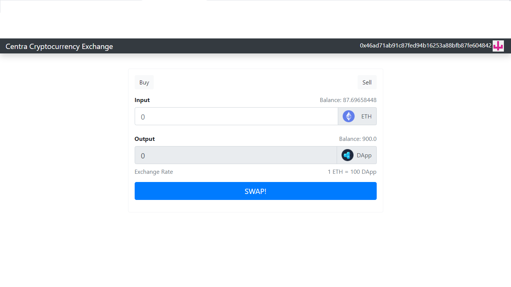

# Crypta - A Centralized Crytocurrency Exchange
>This is a simple cryptocurrency exchange that issues it's own ERC-20 token (the DApp) which can be exchanged with Ether (ETH).

## Table of contents
* [General info](#general-info)
* [Screenshots](#screenshots)
* [Technologies](#technologies)
* [Setup](#setup)
* [Features](#features)
* [Status](#status)
* [Inspiration](#inspiration)
* [Contact](#contact)

## General Info
This is my first project in learning Fullstack Blockchain Development. This DApp is an exchange that runs on a local blockchain and allows users that have test Ether (ETH) to trade (buy and sell) the exchange's token (the DApp token). It is powered by 2 smart contracts: EthSwap - the contract of the exchange that defines the functions for buying & selling tokens AND Token - a contract that describes the requirements of the ERC-20 standard for issuing fungible tokens on the Ethereum Blockchain. 

## Screenshot

## Technologies
* [Solidity](https://docs.soliditylang.org/en/v0.8.4/) - v0.5.0
* [Truffle](https://www.trufflesuite.com/docs/truffle/getting-started/installation) - v5.0.5
* [Ganache](https://www.trufflesuite.com/ganache) 
* [MetaMask](https://metamask.io/)
* [Ethers](https://docs.ethers.io/v5/getting-started/) - v5.2.0
* React - v16.8.4 
* Node JS - v12.16.3 

## Installation
<!-- Describe how to install / setup your local environement / add link to demo version. -->
To setup this project (on a Windows machine):
1. Install the above technologies (Truffle, Ganache, Metamask)
2. Make Sure Ganache is running (Ganache is the local blockchain)
3. Connect your MetaMask wallet to Ganache:  
	a. Click the MetaMask browser extension    
	b. Click the Networks tab and select Custom RPC  
	c. Enter settings:   
		&nbsp;&nbsp;&nbsp;&nbsp;&nbsp;&nbsp;i.   Network Name => Ganache  
		&nbsp;&nbsp;&nbsp;&nbsp;&nbsp;&nbsp;ii.  New RPC URL (the RPC server on your running Ganache) => http://localhost:7545  
		&nbsp;&nbsp;&nbsp;&nbsp;&nbsp;&nbsp;iii. Chain ID => 1337 [Explanation](https://ethereum.stackexchange.com/questions/91072/setup-ganache-with-metamask-what-and-where-is-a-chain-id)  
	d. Click Save  
4. Select the newly added Ganache network and click the profile picture to reveal more settings
5. Select "Import Account"
6. Go to Ganache:  
	&nbsp;&nbsp;&nbsp;&nbsp;&nbsp;&nbsp;i.  Click the key icon on the first address(Important!) (Ganache provides you with 10 accounts each prefunded with test Ether)  
	&nbsp;&nbsp;&nbsp;&nbsp;&nbsp;&nbsp;ii. Copy the private key
7. Go back to MetaMask, make sure the "Private Key" option is selected, paste the private key you copied and click import.

## Setup
<!-- Show examples of usage: -->
To run this project, install it locally using npm:  
`git clone https://github.com/icepaigez/CryptoExchange.git project-name`  
`cd project-name`  
`npm install`   
`truffle migrate`  
`npm start`

## Features
List of features ready and TODOs for future development
* Buy DApp token & Sell ETH
* Sell DApp token & Buy back ETH 

To-do list:
* Add trading fees functionality
* Add more tokens
* Create a Decentralized version of the Exchange
* Improve the UI

## Status
Project is: _in progress_, more features being developed.

## Inspiration
Project inspired by [@DappUniversity](https://twitter.com/DappUniversity), based on [this tutorial](https://www.youtube.com/watch?v=99pYGpTWcXM&t=1584s)

## Contact
Created by [@icepaigez](https://twitter.com/icepaigez) - feel free to contact me!